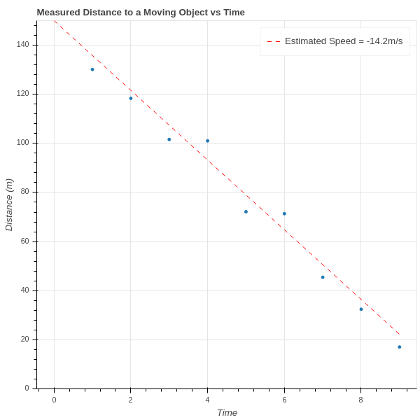

# Linear Regression

## Machine Learning Context

- Given a set of data with associated measurements
- Predict the results of future measurements given a set of known results

Data could be a collection of images, measurements say "this is a duck".

Data could be numerical (such as time intervals) and measurements could be numerical (such as speed of an object
or a stock price).

Simplest case is finding a linear relationship.

## Basic Problem

{width=50%}

## Engine size and MPG

{width=50%}

## Mean Squared Error

Data consists of pairs $\{(x_i,y_i)\}$.

                                                                                                                       
$$ MSE(m,b) = \frac{1}{N}\sum_{i=1}^{n} (y_i-mx_i-b)^2 $$

## Minimize MSE

Write $E$ instead of $MSE$ for simplicity.

$$\begin{aligned} \frac{\partial E}{\partial m} &=                                                                     \frac{1}{N}\sum_{1}^{N}-2x_i(y_i-mx_i-b) \\ \frac{\partial E}{\partial                                                  b} &= \frac{1}{N}\sum_{1}^{N}-2(y_i-mx_i-b) \\ \end{aligned} $$

## Compute the derivatives

$$ \begin{aligned} \frac{1}{N}(\sum_{i=1}^{N} x_i^2)m &+&
\frac{1}{N}(\sum_{i=1}^{N} x_i)b &=& \frac{1}{N}\sum_{i=1}^{N} x_i y_i
\\ \frac{1}{N}(\sum_{i=1}^{N} x_i)m &+& b &=&
\frac{1}{N}\sum_{i=1}^{N} y_{i} \\ \end{aligned} $$

- $\overline{x}=\frac{1}{N}\sum x_{i}$
- $\overline{y}=\frac{1}{N}\sum y_{i}$
- $S_{xx}$, $S_{xy}$, and $S_{yy}$ are $\frac{1}{N}\sum x_{i}^2$, $\frac{1}{N}\sum x_{i}y_{i}$, $\frac{1}{N}\sum y_{i}^2$respectively.

## Solve to find the minima

$$
\begin{aligned}
S_{xx}m&+&\overline{x}b &= S_{xy}\cr
\overline{x}m&+&b &=\overline{y}\cr
\end{aligned}
$$

## Solution

$$ \begin{aligned} m &=
\frac{S_{xy}-\overline{x}\overline{y}}{S_{xx}-\overline{x}^2} \\ b &=
\frac{S_{xx}\overline{y}-S_{xy}\overline{x}}{S_{xx}-\overline{x}^2} \\
\end{aligned} $$
