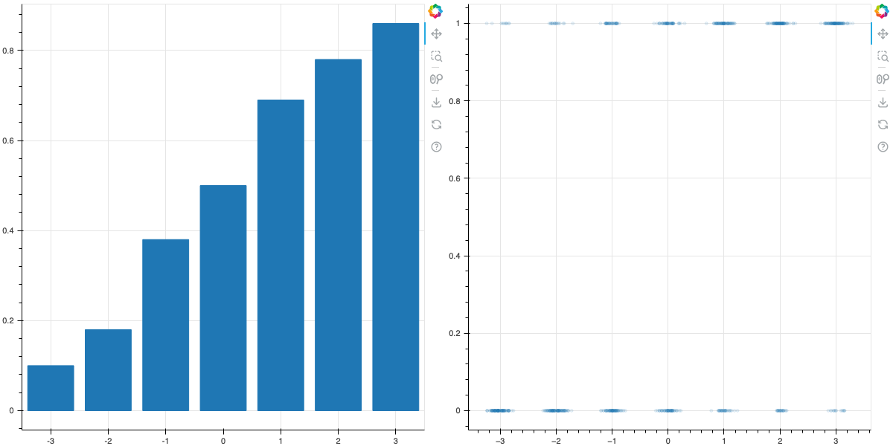

## Logistic Regression

### The logistic model

The log-odds of an event increase linearly with an independent variable.

$$
\log\frac{p}{1-p} = ax+b
$$

**Example:** The chance that a person buys a product depends on how many times they encounter advertising for that product.

### The sigmoid function

$$
\log\frac{p}{1-p}=ax+b
$$

means that

$$
p(x)=\frac{1}{1+e^{-ax-b}}
$$

### The logistic curve

The function

$$
\sigma(x)=\frac{1}{1+e^{-x}}
$$

is called the logistic function.

{width=50%}

### Sample data

Likelihood of event increases with $x$. Out of 100 tries:

| $x$                      | -3  | -2  | -1  | 0   | 1   | 2   | 3   |
| ------------------------ | --- | --- | --- | --- | --- | --- | --- |
| Occurrences (out of 100) | 10  | 18  | 38  | 50  | 69  | 78  | 86  |

### Two points of view

{width=4in}

### The Likelihood

The parameters $a$ and $b$ are unknown. But if we knew them, then
we could figure out how likely our results were. For example,
the chance of getting $10$ positive outcomes is

$$
p(10+ | x=-3, a,b) = C(\sigma(a(-3)+b)^{10}(1-\sigma(a(-3)+b))^{90}
$$

where $C$ is a constant (it's a binomial coefficient).

### More on the likelihood

Assuming independence (given $x$, $a$, and $b$) the chance of our data
is

$$
P(\mathrm{data}|a,b)=C P(10+|x=-3)P(18+|x=-2)\cdots P(86+|x=3)
$$

### Still more

Here each term is

$$
P(y+|x)=\sigma(ax+b)^{y}(1-\sigma(ax+b)^{N(x)-y}
$$

where $N(x)$ is the number of trials with that given $x$ value. (this is a Binomial random variable).

### The log likelihood

We want to find the $a$ and $b$ that make our observed data _most likely_. To do this we need to find $a,b$ that maximize $P$ or, more simply $\log P$.

$$
\log P = \sum_{i=0}^{6} \left[ y_{i}\log P(y_{i}|x_{i}) + (100-y_{i})\log(1-p(y_{i}|x_{i}))\right]
$$

We can drop the constant since it won't affect where the maximum occurs.

### Vector/Regression Form

Our data matrix consists of $N$ rows (and 1 column), one for each person viewing the ads. The entry in each row is the number of times they saw the add.

The target matrix consists of 0 and 1 depending on whether they made a purchase or not.

We want to "fit" an equation that gives $0$ or $1$ as a function of $x$, but we can't do this exactly, only in probabilistic terms.

This is why it's called "regression."

### More on Vector/Regression Form

For each row of our matrix, the chance that $y_i$ is $1$
is $p(x_i)$ (given by the sigmoid function with parameters $a$, $b$) and the chance that $y_i=0$ is $(1-p(x_i))$. So our likelihood is

$$
L(a,b) = C \prod_{i=0}^{N-1} p(x_i)^{y_{i}}(1-p(x_i))^{(1-y_i)}
$$

and

$$
\log L(a,b) = C'+\prod_{i=1}^{N-1} y_{i} \log p(x_i) + (1-y_{i})\log(1-p(x_i)).
$$

Ignoring irrelevant constants this is

$$
\log L = Y\cdot\log p(X) + (1-Y)\cdot\log(1-p(X))
$$

where for each row of $X$, $p(X)$ has $\sigma(ax_i+b)$ with
(unknown) parameters $a$ and $b$.

### The case of multiple features

In the case of multiple features, we have a set of $k$ measurements for each sample (perhaps exposure to different types of ads)
and a single outcome (buy/do not buy). This yields an $N\times k$ data matrix $X$. We seek a set of weights $m_{1},\ldots, m_{k}$
and an "intercept" $b$ so that

$$
\log\frac{p}{1-p}=\sum m_{i}x_{i}+b
$$

relates the log-odds of our event occurring with the values of the features.

**Note:** Just as with linear regression, we can create a "fake" feature that is all $1$, and then extend our data matrix to $N\times (k+1)$.
Then $b=m_{k+1}$ and we can write

$$
\log\frac{P}{1-P}=XM
$$

where the right side is an $N\times 1$ matrix and the left side is an $N\times 1$ matrix whose entries are $\log\frac{p}{1-p}$.

### The probability

From this we get the matrix equation

$$
P = \sigma(XM)
$$

The matrix $P$ has the probability of getting a positive outcome for each sample given the features.

### A geometric remark

One way to think of this is that if the features (a row of $X$), thought of as a vector, points "more in the direction of the weight vector" $M$,
then the probability of getting a positive outcome increases. If it's perpendicular, you get even odds. If it points oppositve the weight vector,
you're unlikely to get what you want.

### The target

We have a vector $Y$ which records when our event happened, and when it didn't.

### The log-likelihood

$$
L(M) = Y^{\intercal}\log(\sigma(XM))+(1-Y^{\intercal})(1-\log(\sigma(XM)))
$$

**Problem:** Given $X$ and $Y$, find $M$ that maximizes this.

### Credit card default

{height=3in}

### Default with logistic line

{height=3in}

### Logistic regression for classification

We can use logistic regression for classification by fitting the logistic model and then saying that a point
should be classified as $1$ if the probability $p$ given by the model says it is $1$ with greater than $.5$ probability.

We could also set a more stringent requirement.

### The "decision surface"

In the logistic regression model, for a given sample $x$ with features $x_{i}$ ($i=1,\ldots, k+1$),
the log odds of that sample yielding a "positive" result is

$$
\log\frac{P}{1-P} = \sum x_{i}m_{i}
$$

where the $m_{i}$ are the weights. Notice that the equation $f(x)=\sum x_{i}m_{i}$ is a linear
function of the features. The equation $f(x)=0$ defines a "hyperplane" in feature space.
(In the graph above, this is the blue line on the default data). On that line, it's even odds if the target is $1$ or $0$.

If $f(x)>0$, the odds are better than even that the target value for that point is $1$; and if $f(x)<0$ the odds are less than even.

If you are trying to classify points, you could say points where $f(x)>0$ should be classified as $1$ (because, more likely than not,
the model says that they are a $1$).

### An example of classification

The sklearn digits dataset consists of a large number of $8\times 8$ bitmap images together with labels from $0$ to $9$.
For example:

{width=2in}

### Digit recogntion (two-class)

We can view our images not as $8\times 8$ arrays but as 64-entry vectors. Let's just focus on the zeros and ones.
We fit a logistic regression model where the target is the value $0$ or $1$. This turns out to do an exceptionally good job at distinguishing these digits.

## Multiclass logistic regression

### Softmax

In multiclass logistic regression, we imagine not only that our data depends on multiple features but
that there are several possible outcomes to our experiment.

Given numbers $z_1,\ldots, z_n$, let

$$
F(z_1,\ldots, z_n) = \sum_{i=1}^{n} e^{z_{i}}
$$

and define the "softmax" function by

$$
\sigma(z_1,\ldots, z_n)=\left[\begin{matrix} \frac{e^{z_1}}{F} & \frac{e^{z_{2}}}{F} &\cdots & \frac{e^{z_{n}}}{F}\end{matrix}\right]
$$

### Softmax

The softmax function is the higher dimensional generalization of the sigmoid function. Notice
that it yields a vector of numbers between $0$ and $1$ whose sum is $1$.

### One-hot encoding

The second important element of multiclass regression is how to encode the labels. For example,
in our digit problem, the labels run from $0$ to $9$. Given an image, we want to compute
probabilities $p_0,\ldots, p_9$ which add to $1$ and, where, hopefully, the largest $p_i$ corresponds
to the true label.

To set this up we convert our labels to one hot encoding. In this picture, we replace our single
vector with entries from $0$ to $9$ with a matrix with 10 columns. Each row of this matrix
has a zero everywhere _except_ in the column corresponding to the label is correct.

So if the label for an image is $2$, the corresponding row of the target matrix is

$$
[0,0,1,0,0,0,0,0,0,0].
$$

### The model

If we have $N$ samples, $k$ features, and $r$ classes, then our weight matrix $M$ is $k\times r$,
our target matrix $Y$ is $N\times r$, and our data matrix $X$ is $N\times k$. Our model says that

$$
P = \sigma(XM)
$$

where $\sigma(XM)$ means "apply the softmax function to each row of $XM$"; each row has $r$ entries.

You can think of $P$ as an attempt to "estimate" $Y$.

The rows of $P$ give the probabilities of getting each possible label for that set of features.

### Max Likelihood

As before we seek $M$ so that the observed classification is most likely given $M$. To find the likelihood:

The probability that the $i^{th}$ sample is in class $j$ is $p_{s}(x_i; M)$ where
$p_{s}$ is the $s^{th}$ entry in the $i^{th}$ row of the matrix $P$. We can write this as

$$
P(i,s) = \prod_{s=1}^{r} p_{s}(x_i; M)^{y_{s}}
$$

since $y_{s}$ is zero except at the correct class. Taking the logarithm makes this a sum:

### Matrix form of max likelihood

$$
\log P(i,s) = \sum_{s=1}^{r} y_{s}\log p_{s}(x_{i}; M).
$$

By independence, the total log probability of this data is the sum of this over all samples and corresponding $y$-values.

$$
\log L(M) = \sum_{i=1}^{N} \sum_{s=1}^{r} y_{s}\log p_{s}(x_{i},M)
$$

This can be written in matrix form as

$$
\log L(M) = \mathrm{trace}(Y^{T}\log \sigma(XM)))
$$

We need to maximize this; we'll consider that later.

### End
