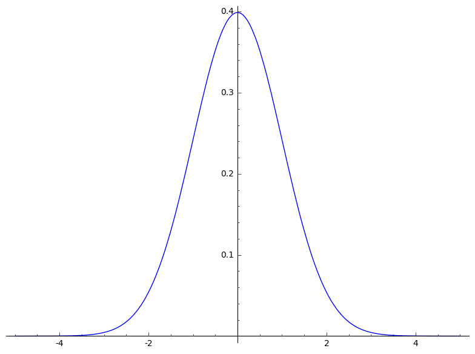
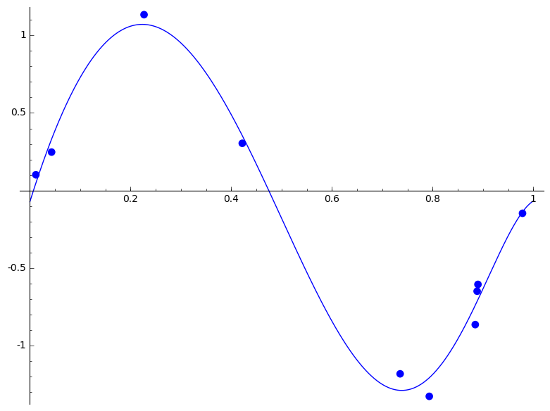
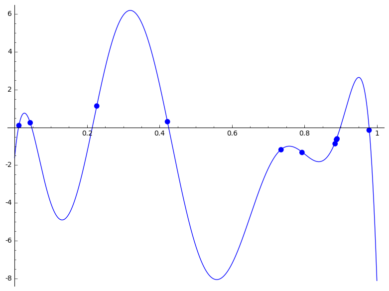

--- 
pagetitle: Multivariate Gaussian 
colorlinks: true 
linkcolor: blue
link-citations: true 
csl: [../../resources/stat.csl]
bibliography: [../../references/references.bib]
reference-section-title: References 
xnos-cleveref: True 
---

\newcommand{\Ber}{\operatorname{Ber}}
\newcommand{\E}{\operatorname{E}}
\newcommand{\V}{\operatorname{Var}}
\newcommand{\diag}{\operatorname{diag}}

\newcommand{\bi}{\mathbf{i}}
\newcommand{\bj}{\mathbf{j}}
\newcommand{\bt}{\mathbf{t}}

\newcommand{\bh}{{\boldsymbol{h}}}
\newcommand{\bw}{{\boldsymbol{w}}}
\newcommand{\bv}{{\boldsymbol{v}}}
\newcommand{\bx}{{\boldsymbol{x}}}
\newcommand{\by}{{\boldsymbol{y}}}
\newcommand{\bb}{{\boldsymbol{b}}}
\newcommand{\bz}{{\boldsymbol{z}}}
\newcommand{\bu}{{\boldsymbol{u}}}
\newcommand{\bX}{{\boldsymbol{X}}}
\newcommand{\bY}{{\boldsymbol{Y}}}
\newcommand{\bZ}{{\boldsymbol{Z}}}

# Multivariate Gaussian 

## Probabilistic Approach to Linear Regression

- $X$: random variable  
 $p(x)$: probability density function of $X$  
&nbsp;&nbsp;  $\Longleftrightarrow$  &nbsp;&nbsp; $p(x) \ge 0$, &nbsp;&nbsp; $\int_{-\infty}^\infty p(x) dx =1$ &nbsp;&nbsp; and 
$$ P[ a \le X \le b ]= \int_a^b p(x) dx $$

 - For example, the *normal* random variable with mean $\mu$ and variance $\sigma^2$ has the density function
$$ p(x) = \frac 1 {\sqrt{2 \pi \sigma^2}} \exp \left ( -\tfrac{(x-\mu)^2}{2 \sigma^2} \right ). $$
 In this case, we write $X \sim \mathcal N (\mu, \sigma^2)$ and
$$ p(x) = \mathcal N(x| \mu, \sigma^2) .$$

{#fig:normal width=50\%}

- $X,Y$: two random variables  
 $p(x,y)$: (joint) probability density function  
 &nbsp;&nbsp;$\Longleftrightarrow$  &nbsp;&nbsp; $p(x,y) \ge 0$,&nbsp;&nbsp; $\int_{-\infty}^\infty \int_{-\infty}^\infty p(x,y) dx dy =1$ &nbsp;&nbsp; and 
$$ P[ (X,Y) \in A ]= \iint \limits_A p(x,y) dx dy $$
- Marginal density functions:
$$p_X(x)= \int_{-\infty}^\infty p(x,y) \, dy  \quad\text{ and } \quad p_Y(y)= \int_{-\infty}^\infty p(x,y) \, dx$$

- The *covariance* of $X$ and $Y$ is defined by
$$ \mathrm{Cov}(X,Y)= \E[ (X-\E(X)) (Y-\E(Y))]=\E(XY) -\E(X)\E(Y) .$$

- The *conditional density* of $X$ given that $Y=y$ is defined to be 
$$ p_{X|Y}(x|y)= \frac {p(x,y)}{p_Y(y)}= \frac {p(x,y)}{\int p(u,y)du} .$$

- More generally, we consider $$ T,X_1, \dots, X_m: \text{ random variables}. $$ 
Let $\bx=(x_1, \dots , x_m)$. Then we have  
$p(t,\bx)$: probability density, &nbsp;&nbsp;  
$p(t|\bx)$: conditional density

- Given random variables $X_1, \dots , X_m$, the *covariance matrix* is defined to be
$$ \Sigma = [ \mathrm{Cov}(X_i, X_j) ]. $$

Recall the settings of linear regression.

 - Input: $x$  &nbsp;&nbsp; Output: $t$  
Observations: $(x_1,t_1), (x_2, t_2), \dots , (x_N, t_N)$

- In many applications we expect some noise in determining the output, and the following assumption is reasonable.

 - Assume that given $x$, the corresponding value of $t$ has a normal distribution
with a mean equal to the value $y(x, \bw)$ of the polynomial curve
$$ y(x,\bw) = w_0 +w_1 x + w_2 x^2 + \cdots + w_D x^D ,$$
where $\bw=[w_0, w_1, \dots , w_D]^\top$.

 - That is to say,  
$$ t=y(x,\bw)+\epsilon , $$
where $\epsilon$ is a Gaussian noise with variance $\sigma^2$.  Then we can write
$$ p(t|x, \bw, \beta) = \mathcal N(t|y(x, \bw), \beta^{-1}), $$
where $\beta = 1/\sigma^2$ is the inverse variance, called *precision*.

- Given $\bx=(x_1, \dots , x_N)$ and $\bt= (t_1, \dots , t_N)$, we have
$$ p(\bt|\bx, \bw, \beta) = \prod_{n=1}^N \mathcal N(t_n|y(x_n, \bw), \beta^{-1}). $$

 - Let $\bx=(x_1, \dots, x_N)$ and $\bt=
(t_1,\dots, t_N)$ be given.  
**Task**: Determine $\bw$ and $\beta$ by maximum likelihood.  
This is a probabilistic approach to the regression problem.

 - We have

$$ p(\bt|\bx, \bw, \beta) = \prod_{n=1}^N \mathcal N(t_n|y(x_n, \bw), \beta^{-1}). $$

 To maximize this function, we take logarithm:
$$ \ln p(\bt|\bx, \bw, \beta) = -\frac \beta 2 \sum_{n=1}^N \{ y(x_n, \bw)-t_n \}^2 + \frac N 2 \ln \beta - \frac N 2 \ln (2 \pi) .$${#eq:log}

***Exercise***: Verify equality +@eq:log. 

 - Thus maximizing likelihood with respect to $\bw$ is equivalent to minimizing the error function $E(\bw)$:
\begin{align*} E(\bw)&=\tfrac 1 2 \sum_{n=1}^N \{ y(x_n, \bw)-t_n \}^2 . \end{align*}

Thus this probabilistic approach leads to the same computation as the usual linear regression to determine $\bw$. Nevertheless, we can also determine the parameter $\beta$ to get maximum likelihood as follow. 

- After finding out $\bw_{\mathrm{ML}}$, take the derivative with respect to $\beta$ to obtain 
$$ \frac 1 {\beta_{\mathrm{ML}}} = \frac 1 N \sum_{n=1}^N \{ y(x_n, \bw_{\mathrm{ML}})-t_n \}^2 .$$

- Finally, the *predictive distribution* is given by
$$ \boxed{ p(t|x, \bw_{\mathrm{ML}}, \beta_{\mathrm{ML}}) = \mathcal N(t|y(x, \bw_{\mathrm{ML}}), \beta_{\mathrm{ML}}^{-1})} .$$

!!Example or code?? 

## Bayesian Linear Regression

 - Bayesian linear regression avoids the over-fitting problem of maximum likelihood.

 - We need  multi-dimensional normal distributions.

Recall one-dimensional normal distribution:
$$ p(x) =  \mathcal N(x| \mu, \sigma^2)= \frac 1 {\sqrt{2 \pi \sigma^2}} \exp \left ( -\tfrac{(x-\mu)^2}{2 \sigma^2} \right ). $$
 

 - $D$-dimensional Gaussian distribution:
 $$ \mathcal N(\bx|\pmb \mu,  \Sigma) = \frac 1 {(2\pi)^{D/2}}\frac 1 {| \Sigma|^{1/2}} \exp \left \{ -\frac 1 2 (\bx -\pmb \mu)^\top  \Sigma^{-1} (\bx -\pmb\mu) \right \} $$
where the $D$-dimensional vector $\pmb \mu$ is the mean, the $D\times D$ matrix $\Sigma$ is the covariance,  and $|\Sigma|$ is the determinant of $\Sigma$.  

 - Assume 
\begin{align*}
p(\bx) & = \mathcal N (\bx | \pmb \mu, \Lambda^{-1}), \\
p(\by|\bx) & = \mathcal N (\by | A\bx + \pmb b, L^{-1}) .
\end{align*}

 - Then we have
\begin{align*}
p(\by) & = \mathcal N (\by| A \, \pmb \mu+\pmb b,  L^{-1}+ A \,  \Lambda^{-1} A^\top), \\
p(\bx|\by) & = \mathcal N( \bx |  \Sigma \, \{ A^\top  L(\by-\pmb b) +  \Lambda \, \pmb \mu \},  \Sigma),
\end{align*}
where $\Sigma=(\Lambda+A^\top  L A)^{-1}$.

!! Do we need to verify this?? 

Recall the settings of linear regression.

 - Input: $x$; &nbsp;&nbsp; Output: $t$  
Observations: $(x_1,t_1), (x_2, t_2), \dots , (x_N, t_N)$

 - Assume that given $x$, the corresponding value of $t$ has a normal distribution
with a mean equal to the value $y(x, \bw)$ of the polynomial curve
$$ y(x,\bw) = w_0 +w_1 x + w_2 x^2 + \cdots + w_D x^D ,$$
where $\bw=[w_0, w_1, \dots , w_D]^\top$.

 - Consider a prior distribution for $\bw$:
$$ p(\bw|\alpha) = \mathcal N(\bw | \pmb{0}, \alpha^{-1} I) . $$
Note that we are taking the initial vector for $\bw$ to be the zero vector $\pmb{0}$.
 - Recall that we have
$$ p(\bt|\bx, \bw, \beta) = \prod_{n=1}^N \mathcal N(t_n|y(x_n, \bw), \beta^{-1}). $$

 - Bayes' Theorem says
$$ \text{(posterior)} \propto \text{(likelihood)} \times \text{(prior)} .$$ In our situation, it becomes $$ p(\bw | \bx, \bt, \alpha, \beta) \propto p(\bt|\bx, \bw, \beta) p(\bw| \alpha) .$$
**Task**: Given the data, determine $\bw$ so that the posterior is maximized.
This process is called *maximum posterior* (MAP). 

 - Take the negative logarithm of the posterior 
\begin{align*} & - \ln p(\bw | \bx, \bt, \alpha, \beta)  \\ & \hskip 1 cm  = - \ln \left [  p(\bt|\bx, \bw, \beta) p(\bw| \alpha) \right ]  + \text{constant} \\ &\hskip 1 cm =   
\frac \beta 2 \sum_{n=1}^N \{ y(x_n, \bw)-t_n \}^2 + \frac \alpha 2 \bw^\top \bw + \text{constants} 
\end{align*}

 - The maximum of the posterior is given by the minimum of
$$ \tilde E(\bw) = \frac \beta 2 \sum_{n=1}^N \{ y(x_n, \bw)-t_n \}^2 + \frac \alpha 2 \bw^\top \bw .  $$
Thus maximizing the posterior distribution is equivalent to minimizing the *regularized* sum-of-square error function. 

 - Let $\phi_i(x)=x^i$ and $$ X=\begin{bmatrix} 1 &1 & \cdots &1 \\ \phi_1(x_1) & \phi_1(x_2) & \cdots &\phi_1(x_N) \\ \phi_2(x_1) & \phi_2(x_2) & \cdots &\phi_2(x_N) \\ \vdots & \vdots & & \vdots \\ \phi_{M-1}(x_1) & \phi_{M-1}(x_2) & \cdots & \phi_{M-1}(x_N) \end{bmatrix} .$$
 Then
$$ \tilde E(\bw) = \frac \beta 2 \lVert X^\top \bw - \bt \rVert^2 + \frac \alpha 2 \bw^\top \bw ,$$ 
 and $$ \nabla \tilde E(\bw)= \beta X(X^\top \bw - \bt) +\alpha \bw =0 . $$
 Thus $$ \bw = \beta S X \bt \quad \text{ with } \quad S^{-1}= \beta X X^\top + \alpha I . $$

We can choose values of the parameters $\alpha$ and $\beta$.

{#fig:bcf width=50\%}

Recall the maximum likelihood gave us

{#fig:f9 width=50\%}

## Predictive distribution
 
- The posterior can be computed explicitly, since the prior and the likelihood are all Gaussian.  Indeed,  we obtain 
$$ p(\bw|\bt) = \mathcal N(\bw | m_N, S_N),$$
where $$ m_N = \beta S_N X \bt \quad \text{ and } \quad S_N^{-1}  = \alpha I +\beta X X^\top .$$

 - Furthermore, we  can compute the predictive distribution $p(t|x, \bx, \bt)$.
 Assume that $\alpha$ and $\beta$ are fixed.
Then the predictive distribution is given by
$$ p(t|x, \bx, \bt) = \int p(t|x, \bw) p(\bw| \bx, \bt) d\bw ,  $$
where $$p(t|x, \bw) = \mathcal N(t|y(x, \bw), \beta^{-1}).$$

- One can compute the integral to obtain
$$p(t|x, \bx, \bt) = \mathcal N(t| m(x), s^2(x) ),$$
where
\begin{align*}
m(x)&= \beta \boldsymbol\phi(x)^\top S \sum_{n=1}^N \boldsymbol\phi(x_n) t_n, \\
s^2(x) &= \beta^{-1} + \boldsymbol\phi(x)^\top S \boldsymbol\phi(x), \\
S^{-1} &= \alpha I + \beta \sum_{n=1}^N \boldsymbol \phi(x_n) \boldsymbol\phi(x)^\top, \\
\boldsymbol \phi(x)&=[1, \phi_1(x), \phi_2(x),  \dots , \phi_M(x)]^\top ,  \quad \phi_i(x)=x^i . 
\end{align*}

 
 

