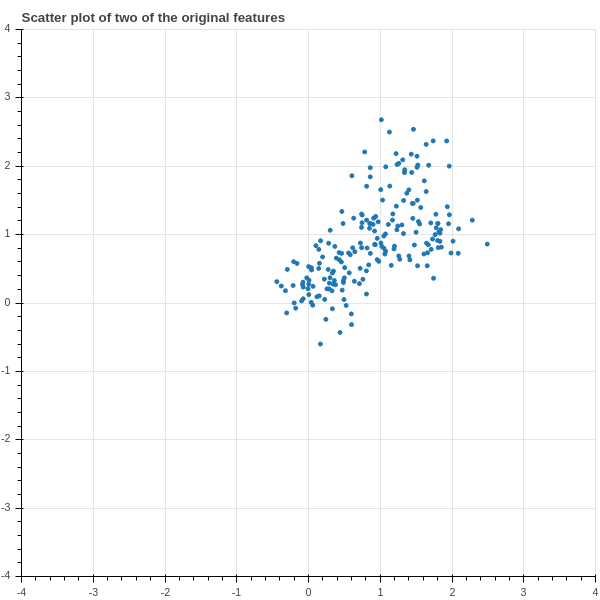
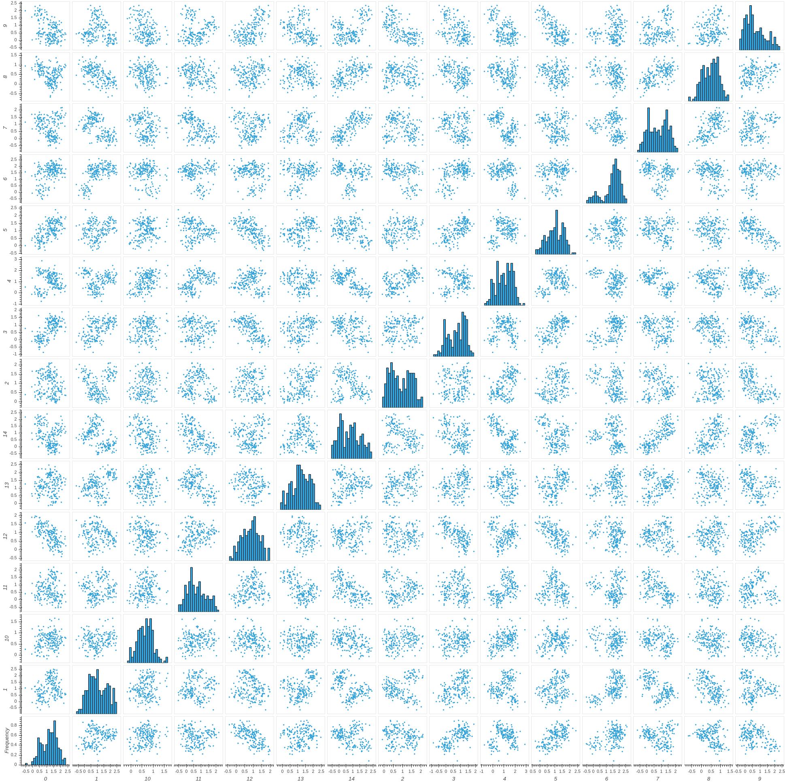
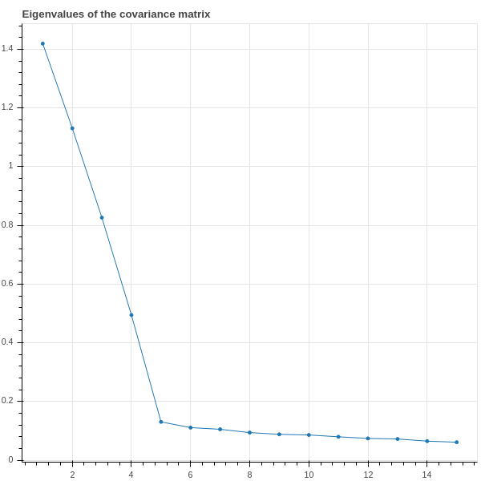
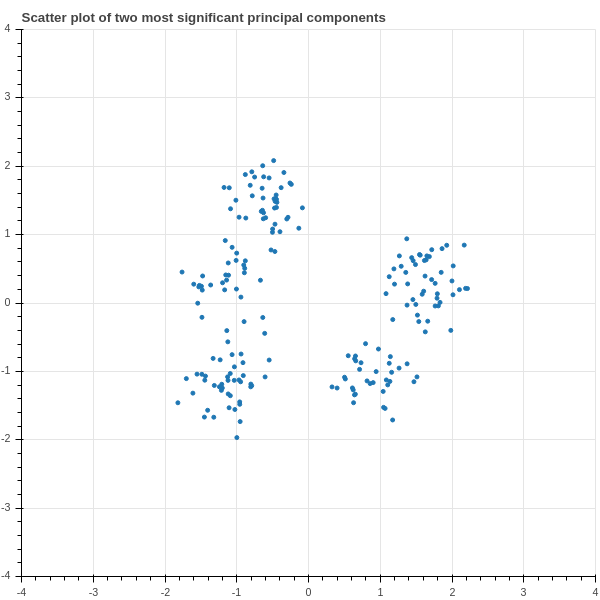

# Dimensionality Reduction

## Dimensionality Reduction -- Preliminaries

- Typical dataset can be represented as $N$ points in $k$-dimensional space, where $N$ and $k$ are large.
- Difficult to visualize 
- Hard to extract meaningful information

Principal Component Analysis identifies "directions" in $\mathbf{R}^{k}$ that most effectively
spread out the data points by maximizing the variance in that direction.

\newpage
## Principal Directions

- Given data $X_{0}$ with covariance matrix $D_{0}$, where the number of samples is $N$ and the number
of features is $k$. 

- The *principal directions* in the data are the orthonormal eigenvectors $u_{1},\ldots,u_{i}$ of $D_{0}$
and the variance in the $u_{i}$ direction is $\sigma_{i}^2=\lambda_{i}$ where $\lambda_{i}$ is the
eigenvalue corresponding to $u_{i}$.   We assume that 
$$
\lambda_{1}\ge \lambda_{2}\ge \cdots\ge \lambda_{k}\ge 0
$$

- From our earlier work we know that $\sigma_{1}^2$ is the largest variance associated to any
score $S$ of unit norm, and $\sigma_{k}$ is the smallest.

\newpage
## Subspaces of maximal variance

**Theorem:** Let $U$ be the span of eigenvectors corresponding to $s$ of the largest eigenvalues of $D_{0}$.
(Since the eigenvalues need not be distinct, there may be several choices for $U$).  Then the
total variance $\sigma^2_{U}$ of the data projected into $U$ is $\sum_{i=1}^{s}\lambda_{i}$, and this is
the largest total variance among all subspaces of dimension $s$.

\newpage
## Projection into subspaces of maximal variance

**Strategy:** Given data in a high dimensional space, project it into a much lower dimensional space
that still captures a high percentage of the total variance.

\newpage
## Example

We have a $200$ points with $15$ features, so a $200\times 15$ matrix with column sums equal to zero.
$3000$ numbers total. How to make sense of it?

First try.  Scatter plot of two features.

\newpage
## Density Plot

\newpage
## Eigenvalues

The first four eigenvalues account for 80\% of the variance.

\newpage
## Two principal directions

