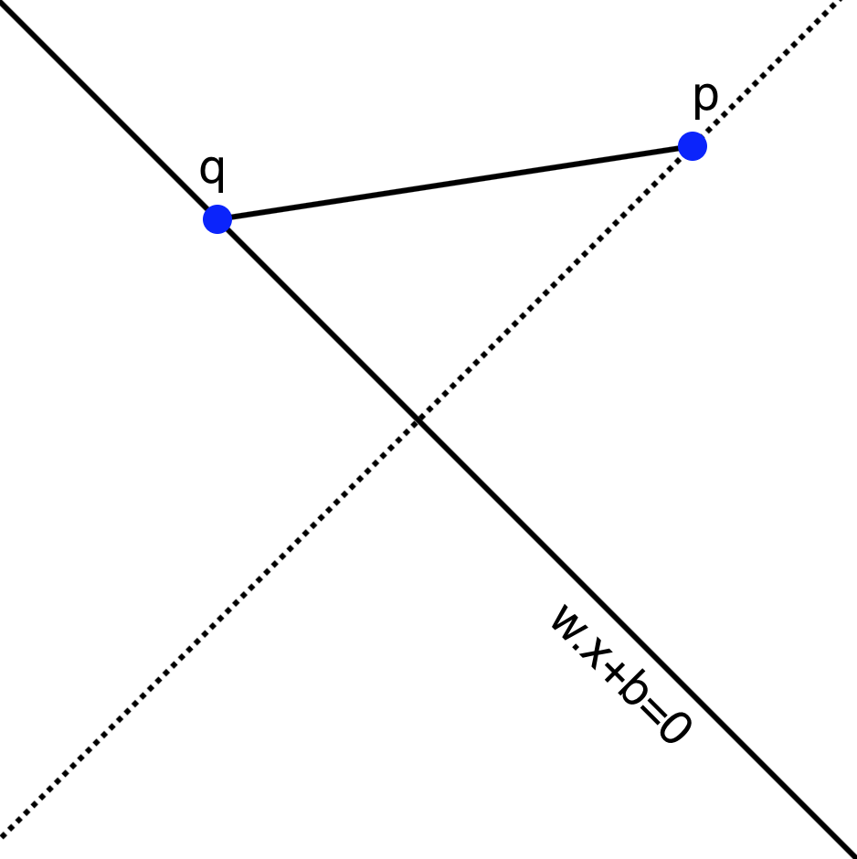

--- 
pagetitle: Support Vector Machines
colorlinks: true 
linkcolor: blue
link-citations: true 
csl: [../../resources/stat.csl]
bibliography: [../../references/references.bib]
reference-section-title: References 
---
# Support Vector Machines

## Introduction

Suppose that we are given a collection of data made up of samples from two different classes,
and we would like to develop an algorithm that can distinguish between the two classes.  For example,
given a picture that is either a dog or a cat,  we'd like to be able to say which
of the pictures are dogs, and which are cats.  For another example, we might want to be able to distinguish
"real" emails from "spam."  This type of problem is called a *classification* problem. 

Typically, one approaches a classification problem by beginning with a large set of data for which
you know the classes, and you use that data to *train* an algorithm to correctly distinguish
the classes for the test cases where you already know the answer.  For example, you start with a few thousand
pictures labelled "dog" and "cat" and you build your algorithm so that it does a good job distinguishing
the dogs from the cats in this initial set of *training data*.  Then you apply your algorithm to pictures
that aren't labelled and rely on the predictions you get, hoping that whatever let your algorithm distinguish
between the particular examples will generalize to allow it to correctly classify images that aren't
pre-labelled.

Because classification is such a central problem, there are many approaches to it.  We will see several
of them through the course of these lectures.  We will begin with 
a particular classification algorithm called "Support Vector Machines" (SVM)
that is based on linear algebra.  The SVM algorithm is widely used in practice and has a beautiful
geometric interpretation, so it will serve as a good beginning for later discussion of more complicated
classification algorithms.

Incidentally, I'm not sure why this algorithm is called a "machine"; the algorithm
was introduced in the paper @vapnik92 where it is called the "Optimal Margin Classifier" and as we shall
see that is a much better name for it.

## A simple example

Let us begin our discussion with a very simple dataset (see @penguins and @penguindata).  This data
consists of various measurements of physical characteristics of 344 penguins of 3 different species:
Gentoo, Adelie, and Chinstrap.  If we focus our attention for the moment on the Adelie and Gentoo
species, and plot their body mass against their culmen depth, we obtain the following scatterplot.

{#fig:penguins width=50%}

Incidentally, a bird's *culmen* is the upper ridge of their beak, and the *culmen depth* is a measure
of the thickness of the beak.  There's a nice picture at @penguindata for the penguin enthusiasts.

A striking feature of this scatter plot is that there is a clear separation between the clusters of
Adelie and Gentoo penguins.  Adelie penguins have deeper culmens and less body mass than Gentoo penguins.
These characteristics seem like they should provide a way to classify a penguin between these two
species based on these two measurements.

One way to express the separation between these two clusters is to observe that one can draw
a line on the graph with the property that all of the Adelie penguins lie on one side of that
line and all of the Gentoo penguins lie on the other. In +@fig:penguinsline I've drawn in
such a line (which I found by eyeballing the picture in +@fig:penguins).  The line has the equation
$$
Y = 250X+400.
$$

{#fig:penguinsline width=50%}

The fact that all of the Gentoo penguins lie above this line means that, for the Gentoo penguins,
their body mass in grams is at least $400$ more than $250$ times their culmen depth in mm. 

$$
\mathrm{Gentoo\ mass}> 250(\mathrm{Gentoo\ culmen\ depth})+400
$$

while

$$
\mathrm{Adelie\ mass}<250(\mathrm{Adelie\ culmen\ depth})+400.
$$

Now, if we measure a penguin caught in the wild, we can compute $250(\mathrm{culmen\ depth})+400$
for that penguin and if this number is greater than the penguin's mass, we say it's an Adelie; otherwise, a Gentoo.
Based on the experimental data we've collected -- the *training* data -- this seems likely to work
pretty well.

## The general case

To generalize this approach, let's imagine now that we have $n$ samples and $k$ features (or measurements)
for each sample. As before, we can represent this data as an $n\times k$ data matrix $X$.  In the penguin
example, our data matrix would be $344\times 2$, with one row for each penguin and the columns
representing the mass and the culmen depth.  In addition to this numerical data, we have a classification
that assigns each row to one of two classes.  Let's represent the classes by a $n\times 1$ vector
$Y$, where $y_{i}=+1$ if the $i^{th}$ sample is in one class, and $y_{i}=-1$ if that $i^{th}$ sample
is in the other.   Our goal is to predict $Y$ based on $X$ -- but unlike in linear regression,
$Y$ takes on the values of $\pm 1$.

In the penguin case, we were able to find a line that separated the two classes and then classify
points by which side of the line the point was on.  We can generalize
this notion to higher dimensions. Before attacking that generalization, let's recall
a few facts about the generalization to $\mathbf{R}^{k}$ of the idea of a line.

### Hyperplanes

The correct generalization of a line given by an equation
$w_1 x_1+ w_2 w_2+b=0$ in $\mathbf{R}^{2}$ is an equation $f(x)=0$ where $f(x)$ is a  degree one polynomial
$$
f(x) = f(x_1,\ldots, x_k) = w_1 x_1 + w_2 x_2 +\cdots + w_k x_k + b 
$${#eq:degreeone}

It's easier to understand the geometry of an equation like $f(x)=0$ in +@eq:degreeone if we think of the coefficients
$w_i$ as forming a *nonzero* vector $w = (w_1,\ldots, w_k)$ in $\mathbf{R}^{k}$ and writing the formula for $f(x)$
as 
$$
f(x) = w\cdot x +b
$$.

**Lemma:** Let $f(x)=w\cdot x+b$ with $w\in\mathbf{R}^{k}$ a nonzero vector and $b$ a constant in $\mathbf{R}$.

- The inequalities $f(x)>0$ and $f(x)<0$ divide up $\mathbf{R}^{k}$ into two disjoint subsets (called half spaces), in the way that a line
in $\mathbf{R}^{2}$ divides the plane in half. 
- The vector $w$ is normal vector to the hyperplane $f(x)=0$.  Concretely this means that if $p$ and $q$ are any two
points in that hyperplane, then $w\cdot (p-q)=0$. 
- Let $p=(u_1,\ldots,u_k)$ be a point in $\mathbf{R}^{k}$. Then the perpendicular distance $D$ from $p$ to the hyperplane $f(x)=0$ is
$$
D = \frac{f(p)}{\|w\|}
$$

**Proof:** The first part is clear since the inequalities are mutually exclusive. For the secon part, 
suppose that $p$ and $q$ satisfy $f(x)=0$.  Then $w\cdot p+b = w\cdot q+b=0$. Subtracting these two
equations gives $w\cdot (p-q)=0$, so $p-q$ is orthogonal to $w$.

For the third part, consider +@fig:triangle.  The point $q$ is an arbitrary point on the hyperplane defined by the equation
$w\cdot x+b=0$.  The distance from the hyperplane to $p$ is measured along the dotted line perpendicular to the hyperplane.
The dot product $w\cdot (p-q) = \|w\|\|p-q\|\cos(\theta)$ where $\theta$ is the angle between $p-q$ and $w$ -- which is complementary
to the angle between $p-q$ and the hyperplane. The
distance $D$ is therefore 
$$
D=\frac{w\cdot(p-q)}{\|w\|}.
$$
However, since $q$ lies on the hyperplane, we know that $w\cdot q+b=0$ so $w\cdot q = -b$.  Therefore $w\cdot(p-q)=w\cdot p+b=f(p)$,
which is the formula we seek.

{#fig:triangle width=30%}

### Linear separability{#sec:linearseparable}

Now we can return to our classification scheme.  The following definition generalizes our two dimensional picture
from the penguin data.

**Definition:** Suppose that we have an $n\times k$ data matrix $X$ and a set of labels $Y$ that assign the
$n$ samples to one of two classes.  Then the labelled data is said to be *linearly separable* if there
is a vector $w$ and a constant $b$ so that, if $f(x)=w\cdot x+b$, then 
$f(x)>0$ whenever $x=(x_1,\ldots, x_k)$ is a row of $X$ -- a sample -- belonging to the $+1$ class,
and $f(x)<0$ whenever $x$ belongs to the $-1$ class.  The solutions to the equation $f(x)=0$ in this situation
form a hyperplane that is called a *separating hyperplane* for the data.

In the situation where our data falls into two classes that are linearly separable, 
our classification strategy  is to find a 
separating hyperplane $f$ for our training data. Then, given a point $x$ whose class we don't know,
we can evaluate $f(x)$ and assign $x$ to a class depending on whether $f(x)>0$ or $f(x)<0$.

This definition begs two questions about a particular dataset:

1.  How do we tell if the two classes are linearly separable?
2.  If the two sets are linearly separable, there are infinitely many separating hyperplanes. To see this,
look back at the penguin example and notice that we can 'wiggle' the red line a little bit and it will
still separate the two sets.  Which is the 'best' separating hyperplane?

Let's try to make the first of these two questions concrete.  We have two sets of points $A$ and $B$ in $\mathbf{R}^{k}$,
and we want to (try to) find a vector $w$ and a constant $b$ so that $f(x)=w\cdot x+b$ takes strictly positive values
for $x\in A$ and strictly negative ones for $x\in B$.  Let's approach the problem by first choosing $w$
and then asking whether there is a $b$ that will work.  In the two dimensional case, this is equivalent to choosing
the slope of our line, and then asking if we can find an intercept so that the line passes between the two classes.

In algebraic terms, we are trying to solve the following system of inequalities: given $w$, find $b$ so that:
$$
w\cdot x+b>0 \hbox{ for all $x$ in A}
$$
and
$$
w\cdot x+b<0\hbox{ for all $x$ in B}.
$$
This is only going to be possible if there is a gap between the smallest value of $w\cdot x$ for $x\in A$ and the largest
value of $w\cdot x$ for $x\in B$.  In other words, given $w$ there is a $b$ so that $f(x)=w\cdot x+b$ separates $A$ and $B$
if
$$
\max_{x\in B}w\cdot x < \min_{x\in A} w\cdot x.
$$
If this holds, then choose $b$ so that $-b$ lies in this open interval and you will obtain a separating hyperplane.

**Proposition:** The sets $A$ and $B$ are linearly separable if there is a $w$ so that
$$
\max_{x\in B}w\cdot x < \min_{x\in A} w\cdot x
$$
If this inequality holds for some $w$, and $-b$ within this open interval, then $f(x)=w\cdot x+b$ is a separating hyperplane 
for $A$ and $B$.

*@fig:penguinhwy2 is an illustration of this argument for a subset of the penguin data.  Here, we have fixed $w=(250,-1)$
coming from the line $y=250x+400$ that we eyeballed earlier.  For each Gentoo (green) point $x_{i}$, we computed $-b=w\cdot x_{i}$ 
and drew the line $f(x) = w\cdot x - w\cdot x_{i}$ giving a family of parallel lines through each of the green points. 
Similarly for each Adelie (blue) point we drew the corresponding line.  The maximum value of $w\cdot x$ for the blue points
turned out to be $-75$ and the minimum value of $w\cdot x$ for the green points turned out to be $525$.  Thus we have
two lines with a gap between them, and any parallel line in that gap will separate the two sets. 

Finally, among all the lines with this particular $w$, it seems that the **best** separating line is the one running
right down the middle of the gap between the boundary lines.  Any other line in the gap will be closer to either the blue
or green set that the midpoint line is.

{#fig:penguinhwy2 width=50%}

Let's put all of this together and see if we can make sense of it in general.

Suppose that $A^{+}$ and $A^{-}$ are finite point sets in $\mathbf{R}^{k}$ and 
$w\in\mathbf{R}^{k}$
such that
$$
B^{-}=\max_{x\in A^{-}}w\cdot x < \min_{x\in A^{+}}w\cdot x=B^{+}.
$$
Let $x^{-}$ be a point in $A^{-}$ with $w\cdot x^{-}=B^{-}$ and $x^{+}$ be a point in $A$ with $w\cdot x^{+}=B^{+}$.
The two hyperplanes $f^{\pm}(x) = w\cdot x - B^{\pm}$ have the property that:
$$
f^{+}(x)\ge 0\hbox{ for }x\in A^{+}\hbox{ and }f^{+}(x)<0\hbox{ for }x\in A^{-}
$$
and
$$
f^{-}(x)\le 0\hbox{ for }x\in A^{-}\hbox{ and }f^{-}(x)>0\hbox{ for }x\in A^{+}
$$

Hyperplanes like $f^{+}$ and $f^{-}$, which "just touch" a set of points, are called supporting hyperplanes.

**Definition:** Let $A$ be a set of points in $\mathbf{R}^{k}$. A hyperplane $f(x)=w\cdot x+b=0$ is called a 
*supporting hyperplane* for $A$ if $f(x)\ge 0$ for all $x\in A$ and $f(x)=0$ for at least one point in $A$,
or if $f(x)\le 0$ for all $x\in A$ and $f(x)=0$ for at least one point in $A$.

The gap between the two supporting hyperplanes $f^{+}$ and $f^{-}$ is called the *margin* between $A$ and $B$
for $w$.

**Definition:** Let $f^{+}$ and $f^{-}$ be as in the discussion above for point sets $A^{+}$ and $A^{-}$ and
vector $w$.  Then the orthogonal distance between the two  hyperplanes $f^{+}$ and $f^{-}$ is called
the geometric margin $\tau_{w}(A^{+},A^{-})$ (along $w$) between $A^{+}$ and $A^{-}$.  We have
$$
\tau_{w}(A^{+},A^{-})=\frac{|B^{+}-B^{-}|}{\|w\|}.
$$

**Definition:** The *optimal margin* $\tau(A^{+},A^{-})$ between $A^{+}$ and $A^{-}$ is the largest value of $\tau_{w}$
over all possible $w$:
$$
\tau(A^{+},A^{-}) = \max_{w} \tau_{w}(A^{+},A^{-}).
$$
If $w$ is such that $\tau_{w}=\tau$, then the hyperplane $f(x)=w\cdot x - \frac{(B^{+}+B^{-})}{2}$
is the yields the *optimal margin classifying hyperplane*.  

The optimal classifying hyperplane runs "down the middle" of the gap between the two supporting hyperplanes $f^{+}$
and $f^{-}$ that give the sides of the optimal margin.

