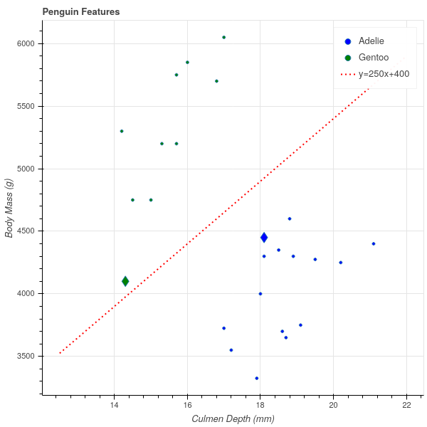

## Margins

To illustrate the ideas of the previous section, and to address the second question raised there about the best separating hyperplane,
let's go back to a simplified version of the

{#fig:penguinmargin width=50%}

In the argument in +@sec:linearseparable, we considered the values $w\cdot x$ as $x$ ranged over each of the
two subsets -- the blue and green points in our example and we 
We can move the line by adjusting the intercept variable, increasing it to $b^{+}$ where
$f(x) = w\cdot x+b^{+}$ passes through one of the points in the positive cluster.  Similarly, we can move the value $b_0$
down to $b^{-}$ until the line passes through one of the points in the negative cluster.  The two hyperplanes
$f(x)=w\cdot x+b^{+}$ and $f(x)=w\cdot x+b^{-}$ are parallel and the region between them is free of points from either cluster.
We can't move the hyperplanes any further, because we'd pass a point in a cluster and then we wouldn't have separation.
We illustrate this in +@fig:penguinhwy.

One way to measure how well this line separates the two clusters is to ask how close the nearest
point in each cluster is to the line.  Looking at +@fig:penguinmargin, you'll notice that the closest point
in the green (Gentoo) cluster, marked with a diamond sybmol, is nearer to the line than is the closest point -- the blue diamond --
in the blue (Adelie) cluster. So, at least as far as this subset
of the data is concerned, we could get better separation if we moved the line downwards.  

Of course, we could also tilt the line by changing its slope, and perhaps if we increased the slope
a bit, that would get us better separation as well.

In any case, this suggests that we measure the effectiveness of our line at separating the two clusters
by *looking at the distance from the line to the closest point(s) in each cluster, and trying to make those
distances as large as possible.*  

The green line in +@fig:penguinhwy has the property that $f(x)\ge 0$ for all of the green points, $f(x)=0$ for at least one green point,
and $f(x)<0$ for all of the blue points.  The blue line has the same properties with the signs reversed.  Lines (or hyperplanes)
with this property are called *supporting hyperplanes.*

**Definition:** A hyperplane $f(x)=w\cdot x+b$ is a supporting hyperplane for a set of points $A=\{x_1,\ldots, x_N\}$ in $\mathbf{R}^{k}$
if 

- $f(x)\ge 0$ for all $x\in A$, or $f(x)\le 0$ for all $x\in A$.
- $f(x)=0$ for at least one $x\in A$.

This discussion leads to a way to identify the *best* separating hyperplane.
