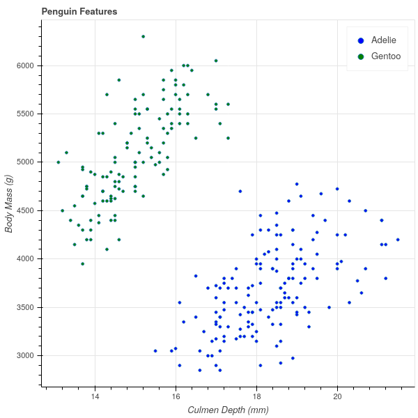

# Support Vector Machines

## Introduction

- Support Vector Machines are a classification algorithm based on geometry.
- I have no idea why they are called "machines."  They are also called "Optimal Margin
Classifiers"  and that is a better name.
- They have the advantage that, once "fit" to the data, they are fast to evaluate.

\newpage
## The Basic Idea

Let's look at the following data from the Palmer Penguins dataset. 
(See https://github.com/allisonhorst/palmerpenguins)


{width=50%}

This plot shows "Culmen Depth" (or Bill depth) vs Body Mass for two different species of penguins.


\newpage
## Classifying line

- Notice that the two groups of penguins are separated by a line. 
- Actually many lines.

{height=40%}

If 
```
Penguin Mass > 250(Penguin Bill Depth)+400
```
then it's a Gentoo, otherwise an Adelie.

## Optimal Margin 

The *margin* associated with such a separating line is the gap between the closest points in the two
sets measured perpendicular to the line.

"Support Vector Machine" or "Optimal Margin Classifier" problem: **Find the line separating the
two sets with the largest possible margin.**

